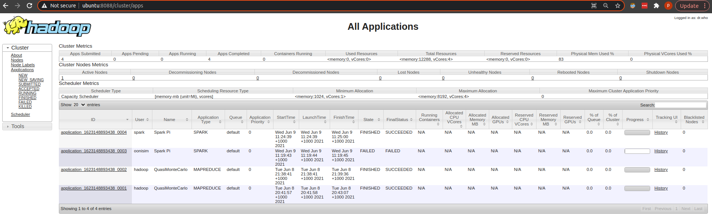

Spark/Hadoop YARN cluster deployment using Ansible
=========

## Objective
Setup Spark/Hadoop YARN cluster with Ansible in an environment (either AWS, on-premise, or local PC).

* [Cluster Mode Overview](https://spark.apache.org/docs/latest/cluster-overview.html)

### Approach
* Dependency should be injected  
Use environment variables to specify the runtime nodes e.g. master node host. 

* Separation of concerns - Each module must NOT know about the details of other modules.

### Prerequisite

Ansible requires Python and pip both Ansible master and target nodes. Some Python packages would require installations using the Linux distribution package manager.

Tested with Ansible:
```
ansible [core 2.11.1] 
  config file = None
  configured module search path = ['/home/oonisim/.ansible/plugins/modules', '/usr/share/ansible/plugins/modules']
  ansible python module location = /home/oonisim/.local/lib/python3.8/site-packages/ansible
  ansible collection location = /home/oonisim/.ansible/collections:/usr/share/ansible/collections
  executable location = /home/oonisim/.local/bin/ansible
  python version = 3.8.5 (default, May 27 2021, 13:30:53) [GCC 9.3.0]
  jinja version = 3.0.1
  libyaml = True
```

Topology
------------
Simple 1 master + N workers (N can be increased by a parameter) in a subnet. Master redundancy is not implemented. AWS environment can be created by the Ansible playbooks.


Repository Structure
------------

### Overview

Ansible playbooks and inventories. To install in AWS, use aws inventory, or use local for local PC installation.

```
.
├── installation    <---- Hadoop+Spark cluster installation home (on AWS or local)
│   ├── ansible     <---- Ansible playbook directory
│   │   ├── aws
│   │   │   ├── creation             <---- Module to create AWS environment (optional: to create an AWS environment)
│   │   │   ├── operations
│   │   │   ├── conductor.sh
│   │   │   └── player.sh
│   │   └── cluster
│   │       ├── 01_prerequisite      <---- Module to setup Ansible pre-requisites
│   │       ├── 02_os                <---- Module to setup OS to install Spark
│   │       ├── 02_packages          <---- Module to setup software packages
│   │       ├── 20_hadoop            <---- Module to setup Hadoop/YARN cluster
│   │       ├── 30_spark             <---- Module to setup Spark cluster
│   │       ├── 40_spark             <---- Module to run Spark applications (naive bayes, etc)
│   │       ├── 510datadog           <---- Module to setup datadog monitoring (option)
│   │       ├── conductor.sh         <---- Script to conduct playbook executions
│   │       └── player.sh            <---- Playbook player (to be used to decrypt Ansible vault key)
│   ├── conf
│   │   └── ansible          <---- Ansible configuration directory
│   │       ├── ansible.cfg  <---- Configurations for all plays
│   │       └── inventories  <---- Each environment has it inventory here
│   │           ├── aws      <---- AWS environment inventory
│   │           ├── local    <---- local environment inventory
│   │           │   ├── env
│   │           │   │   ├── hadoop
│   │           │   │   │   ├── env
│   │           │   │   │   │   └── hadoop_variables.sh  <--- Hadoop environment
│   │           │   │   │   └── etc
│   │           │   │   │       └── hadoop-env.sh
│   │           │   │   ├── os
│   │           │   │   │   └── env
│   │           │   │   │       └── hosts
│   │           │   │   └── spark
│   │           │   │       ├── conf
│   │           │   │       └── env
│   │           │   │           └── spark_variables.sh   <--- Spark environment 
│   │           └── template
│   └── tools
├── master        <---- Spark master node data for run_Spark.s created by setup_aws.sh or update manally.
├── setup.sh      <---- Run setup_aws.sh and run_Spark.sh
├── setup_aws.sh  <---- Run AWS setups
└── run.sh        <---- Run setups
```

#### Inventory
Ansible manages a group of nodes in an environment in a unit called [Inventory](https://docs.ansible.com/ansible/latest/user_guide/intro_inventory.html). For each environment, an inventory directory is defined in the directory. 
```
installation/conf/ansible/inventories/
```

For instance, to manage a local PC environment named 'local', create the directory **local** and set **local** to the TARGET_INVENTORY environment variable.
```
installation/conf/ansible/inventories/local
```

#### Module and structure

Module is a set of playbooks to execute a specific task e.g. 30_spark is to setup a Spark cluster. Each module directory has the same structure having plays and scripts.
```
30_spark/
├── Readme.md         <---- (option) description of the module
├── plays
│   ├── roles
│   │   ├── common    <---- Common tasks for both master and workers
│   │   ├── master    <---- Setup master node
│   │   └── worker    <---- Setup worker nodes
│   ├── site.yml
│   ├── masters.yml   <--- playbook for master node
│   └── workers.yml   <--- playbook for worker nodes
└── scripts
    └── main.sh       <---- script to run the module (each module can run separately/repeatedly)
```


### Configurations

Parameters for a TARGET_INVENTORY are isolated in group_vars for the inventory.
```
.
├── conf    <----- CONF_DIR environment variable
│   └── ansible
│      ├── ansible.cfg
│      └── inventories
│           └── aws                     <---- For an AWS environment
│               ├── group_vars
│               │   ├── all             <---- Configure properties in the 'all' group vars
│               │   │   ├── env.yml     <---- Enviornment parameters e.g. ENV_ID to identify and to tag configuration items
│               │   │   ├── server.yml  <---- Server parameters
│               │   │   ├── aws.yml     <---- e.g. AMI image id, volume type, etc (AWS only)
│               │   │   ├── spark.yml   <---- Spark configurations
│               │   │   └── datadog.yml <---- Optional for Datadog (AWS only)
│               │   ├── masters         <---- For master group specifics
│               │   └── workers
│               └── inventory
│                   ├── ec2.ini         <---- Ansible dynamic inventory configurations (AWS only)
│                   ├── ec2.py          <---- Ansible dynamic inventory script (AWS only)
│                   └── hosts           <---- Target node(s) using tag values (For AWS, auto-configured upon creating AWS environment)
```

#### Hadoop 

Update the installation/conf/ansible/inventories/${TARGET_INVENTORY}/group_vars/all/21.hadoop.yml for:

* HADOOP_VERSION
* HADOOP_PACKAGE_CHECKSUM

```
installation/conf/ansible/inventories/${TARGET_INVENTORY}/group_vars/all/21.hadoop.yml
```

#### SPARK
Update the installation/conf/ansible/inventories/${TARGET_INVENTORY}/group_vars/all/31.spark.yml for:
<pre>
SPARK_VERSION
SPARK_PACKAGE_CHECKSUM
SPARK_SCALA_VERSION     <---- Scala versoin used to compile the Spark package
SPARK_MASTER            <---- Spark master e.g. local, yarn, etc.
SPARK_DEPLOY_MODE       <---- Spark deployment mode e.g. cluster or client.
SPARK_DRIVER_MEMORY     <---- Default Spark driver memory.
</pre>

#### SPARK_ADMIN and HADOOP_USERS
Set an account name to SPARK_ADMIN in server.yml. The account is created by a playbook via HADOOP_USERS in server.yml. Set an encrypted password in the corresponding field. Use [mkpasswd as explained in Ansible document](http://docs.ansible.com/ansible/latest/faq.html#how-do-i-generate-crypted-passwords-for-the-user-module).


#### Datadog (optional & AWS only)

Create a Datadog trial account and set the environment variable DATADOG_API_KEY to the [Datadog account API_KEY](https://app.datadoghq.com/account/settings#api). The Datadog module setups the monitors/metrics to verify that Spark is up and running, and can start monitoring and setup alerts right away.
Update installation/conf/ansible/inventories/${TARGET_INVENTORY}/group_vars/all/51.datadog.yml for other parameters.


---
# Preparations

# Local

See [Linux Setup](https://github.com/oonisim/linux-setup) for the details.

## Ansible targets

### SSH
#### SSH Server
Run a SSH server and let it accept the public key authentication. May better to disable password authentication once key setup is done.

### Ansible account
Make sure to have an account to run ansible playbooks on the targets. Run the script on the targets which also looks after the authorized_key part. It will ask for SSH public key to be able to login as the ansible account. Prepare it in advance.

```
./installation/ansible/cluster/01_prerequisite/scripts/setup_ansible_user.sh
```

SSH key files are to be copied. If passphrase is set, then need to place the way to provide the passphrase automatically.

#### pip
pip needs to be available for the ansible account to use Ansible pip module.

**Tried to use ansible user local pip but did not work. Hence using system pip.**

For instance, to install pip3 on Ubuntu.
```
apt install -fqy python3-pip
```

<br/>


## Ansible master
### MacOS
To be able to use [realpath](https://stackoverflow.com/questions/3572030/bash-script-absolute-path-with-osx).
```
brew install coreutils
```

### Python
Ansible itself relies on Python. Use Python 3 as Python 2 is end of support.

### pip

Install Ansible relies on pip. See [PyPA pip installation](https://pip.pypa.io/en/stable/installing/).
pip installation is looked after in the 01_prerequisite module setup.sh via get-pip.py.
```
./installation/ansible/cluster/01_prerequisite/scripts/setup.sh
```

### Ansible
Install the latest Ansible with pip. If the host is RHEL/CentOS/Ubuntu, run below will setup Ansible.

```
(cd ./installation/ansible/cluster/01_prerequisite/scripts && ./setup.sh)
```

#### Vault password
Set the password to decrypt Ansible valut in the file.
```
~/.ansible/.vault_pass.txt
```

#### Auto-login to Ansible targets

Make sure that REMOTE_USER is able to login to the Ansible target hosts without passwords.

```
ssh -v -oStrictHostKeyChecking=no $(hostname) uptime
```

### SSH

#### Silent
Configure ssh-agent and/or .ssh/config with the SSH key to be able to SSH into the targets without providing pass phrase.

```
eval $(ssh-agent)
ssh-add <SSH key>
ssh ${REMOTE_USER}@<server> sudo ls  # no prompt for asking password
```


# AWS

This section is optional. Only when you needs to create an AWS environment to deploy Hadoop + Spark.

## Ansible master

### AWS CLI
Prepare EC2 keypair, install AWS CLI (use --user) and set the environment variables. Make sure to set ~/.local/bin to PATH to use local python site.

* AWS_ACCESS_KEY_ID
* AWS_SECRET_ACCESS_KEY
* EC2_KEYPAIR_NAME         <---- AWS SSH keypair name
* REMOTE_USER              <---- AWS EC2 user (centos for CentOs, ec2-user for RHEL)

### Ansible
Install the latest Ansible and Boto (botocore + boto3) with pip (--user). If the host is RHEL/CentOS/Ubuntu, run below will setup Ansible.

```
(cd ./installation/ansible/cluster/01_prerequisite/scripts && ./setup.sh)
```

Test the Ansible AWS dynamic inventory script. Make sure to have the [latest script](https://raw.githubusercontent.com/ansible/ansible/devel/contrib/inventory/ec2.py). 
```
installation/conf/ansible/inventories/aws/inventory/ec2.py
```

### SSH
Configure ssh-agent and/or .ssh/config with the AWS SSH PEM to be able to SSH into the targets without providing pass phrase. Create a test EC2 instance and test.

```
eval $(ssh-agent)
ssh-add <AWS SSH pem>
ssh ${REMOTE_USER}@<EC2 server> sudo ls  # no prompt for asking password
```

## Execution

Run below and it will ask for the location to save the auto-generated files.

```aidl
installation/setup_aws.sh
```

---

# Hadoop/YARN & Spark

## Ansible master

### Environment variables

#### TARGET_INVENTORY
Update TARGET_INVENTORY with the inventory name with the Ansible inventory name.

#### REMOTE_USER
Update REMOTE_USER with the Linux account name to SSH login into the Ansible targets who can sudo without password as the Ansible remote_user to run the playbooks. 

Ansible master needs to SSH login to the target nodes with the user without providing a password (use public key authentication and ssh-agent), and have the permission to sudo without providing an password (configure /etc/sudoers for the user).

#### OS
Update ```installation/conf/ansible/inventories/local/env/os/env/hosts``` to be able to resolve the host names in the cluster. Alternatively use DNS.
```
127.0.1.1	ubuntu   # For local installation, or all the host/ip pairs.
```

#### Spark/Hadoop
Make sure that HADOOP_ADMIN is able to login to the hadoop worker hosts without passwords.
Make sure that SPARK_ADMIN is able to login to the spark worker hosts without passwords.

Update ```installation/conf/ansible/inventories/${TARGET_INVENTORY}/env/hadoop/env/hadoop_variables.sh```:
```
HADOOP_WORKERS
HADOOP_NN_HOSTNAME
YARN_RM_HOSTNAME
```

Update ```installation/conf/ansible/inventories/${TARGET_INVENTORY}/env/spark/env/spark_variables.sh```:
```
SPARK_WORKERS
SPARK_MASTER_HOSTNAME
SPARK_MASTER_IP
```

The ./installation/_setup_env_cluster.sh exports the variables as environment variables.

```
export $(cat ${DIR}/conf/ansible/inventories/${TARGET_INVENTORY}/env/hadoop/env/hadoop_variables.sh | grep -v '^#' | xargs)
export $(cat ${DIR}/conf/ansible/inventories/${TARGET_INVENTORY}/env/spark/env/spark_variables.sh   | grep -v '^#' | xargs)
```

# Execution
Make sure the environment variables are set.

Environment variables:
* TARGET_INVENTORY
* REMOTE_USER
* AWS_ACCESS_KEY_ID       (for AWS only)
* AWS_SECRET_ACCESS_KEY   (for AWS only)
* EC2_KEYPAIR_NAME        (for AWS only)
* DATADOG_API_KEY         (for AWS only)


### Hadoop + Spark
Run ./installation/run_cluster.sh. If DATADOG_API_KEY is not set, the 51_datadog module will cause errors.

```
.
├── cluster
├── maintenance.sh
├── setup.sh
├── setup_aws.sh
└── setup_cluster.sh   <---- Run this script
```

Alternatively, run each module one by one, and skip 51_datadog if not using.
```
export HADOOP_WORKERS="<worker hosts>"
HADOOP_NN_HOSTNAME="<name node host>"
YARN_RM_HOSTNAME="<yarn resource manager host>"
SPARK_WORKERS="<spark worker hosts>"
SPARK_MASTER_HOSTNAME="<spark master host>"
SPARK_MASTER_IP="<spark master IP to be set in /etc/hosts file>"  # Not required for local deployment

pushd ansible/Spark/<module>/scripts && ./main.sh or
ansible/Spark/<module>/scripts/main.sh aws <ansible remote_user>
```

Modules are:
```
├── 01_prerequisite      <---- Module to setup Ansible pre-requisites
├── 02_os                <---- Module to setup OS to install Spark
├── 03_packages          <---- Module to setup OS to install Spark
├── 20_hadoop            <---- Module to setup Spark cluster
├── 30_spark             <---- Module to setup Spark cluster
├── 40_application       <---- Module to run Spark applications
├── 50_datadog           <---- Module to setup datadog monitoring (option)
├── conductor.sh         <---- Script to conduct playbook executions
└── player.sh            <---- Playbook player
```


---
# Configuration details
## Hadoop 

### Hadoop environment variables in runtime environment

To setup environment variables such as HADOOP_HOME, setup /etc/profile.d/hadoop.sh in each node. For Ubuntu, update /etc/bash.bashrc.
* [Scripts in /etc/profile.d Being Ignored?](https://askubuntu.com/questions/438150/scripts-in-etc-profile-d-being-ignored/438170)

See:
```
installation/ansible/cluster/20_hadoop/plays/roles/common/tasks/bash.yml
installation/ansible/cluster/20_hadoop/plays/roles/common/templates/profile.d/hadoop.sh.j2
```

### Hadoop configuration files

Setup files under ${HADOOP_HOME}/etc/hadoop by copying files under ./installation/ansible/cluster/20_hadoop/plays/roles/common/templates/etc via Ansible template replacing the variables.
e.g. mapreduce-site.xml
```aidl
<configuration>
    <property>
      <name>mapreduce.framework.name</name>
      <value>yarn</value>
    </property>
    <property>
        <name>mapreduce.map.memory.mb</name>
        <value>{{ YARN_MR_MAP_MEMORY_MB }}</value>
    </property>
    <property>
        <name>mapreduce.map.java.opts</name>
        <value>{{ YARN_MR_MAP_JAVA_OPTS }}</value>
    </property>
    <property>
        <name>mapreduce.reduce.memory.mb</name>
        <value>{{ YARN_MR_REDUCE_MEMORY_MB }}</value>
    </property>
    <property>
        <name>mapreduce.reduce.java.opts</name>
        <value>{{ YARN_MR_REDUCE_JAVA_OPTS }}</value>
    </property>

   <!--
  Without below, Error: Could not find or load main class org.apache.hadoop.mapreduce.v2.app.MRAppMaster .
  See https://stackoverflow.com/questions/50927577/could-not-find-or-load-main-class-org-apache-hadoop-mapreduce-v2-app-mrappmaster as well.
   -->
    <property>
      <name>yarn.app.mapreduce.am.env</name>
      <value>HADOOP_MAPRED_HOME={{ HADOOP_HOME }}</value>
    </property>
    <property>
      <name>mapreduce.map.env</name>
      <value>HADOOP_MAPRED_HOME={{ HADOOP_HOME }}</value>
    </property>
    <property>
      <name>mapreduce.reduce.env</name>
      <value>HADOOP_MAPRED_HOME={{ HADOOP_HOME }}</value>
    </property>

</configuration>

```

## Spark on YARN

### Spark master
Spark master is specified as "yarn" in the installation/ansible/cluster/30_spark/plays/roles/common/templates/conf/spark-defaults.conf.

When using a resource manager such as YARN, no need to start a Spark cluster as the spark jobs are to be started by YARN.

###  Hadoop configuration files

To communicate with the YARN Resource Manager, Spark needs to be aware of your Hadoop configuration. This is done via the ```HADOOP_CONF_DIR``` environment variable. 

* [Launching Spark on YARN](https://spark.apache.org/docs/latest/running-on-yarn.html#launching-spark-on-yarn) for Spark to access Hadoop/Yarn. 
* [Install, Configure, and Run Spark on Top of a Hadoop YARN Cluster
 October 7, 2020](https://www.linode.com/docs/guides/install-configure-run-spark-on-top-of-hadoop-yarn-cluster/)

See Spark Documentation - [Spark Configuration](https://spark.apache.org/docs/latest/configuration.html#inheriting-hadoop-cluster-configuration).
>To read and write from HDFS using Spark, there are two Hadoop configuration files that should be included on Spark’s classpath:
hdfs-site.xml, which provides default behaviors for the HDFS client.
core-site.xml, which sets the default filesystem name.

> To make these files visible to Spark, set HADOOP_CONF_DIR in $SPARK_HOME/conf/spark-env.sh to a location containing the configuration files.

> Note that conf/spark-env.sh does not exist by default when Spark is installed. However, you can copy conf/spark-env.sh.template to create it. **Make sure you make the copy executable**.

The files are copied to the ${HADOOP_CONF_DIR} on the Spark nodes. See:

```
installation/ansible/cluster/30_spark/plays/roles/common/tasks/hadoop.yml
```

#### YARN configuration parameters

See [Running Spark on YARN - Spark properties](http://spark.apache.org/docs/latest/running-on-yarn.html#spark-properties)

#### Environment variables for Hadoop
Environment variables referring to the Hadoop/Yarn configuration directories in the Spark nodes are setup via the /etc/profile.d/spark.sh.

TODO: Move to ${SPARK_HOME}/conf/spark-env.sh

```
HADOOP_CONF_DIR
YARN_CONF_DIR
```

See:
```
installation/ansible/cluster/30_spark/plays/roles/common/templates/profile.d
```

---

# Validation

## Confirm YARN resource manager

Access the YARN resource manager web UI at ```http://${HADOOP_NN_HOSTNAME}:8088```.

For the YARN ports, see [YARN service ports](https://docs.cloudera.com/HDPDocuments/HDP3/HDP-3.1.0/administration/content/yarn-ports.html)




## Test Hadoop/YARN

Instead of "hadoop" command, use "yarn" command to run sample programs.
```
export HADOOP_WORKERS=ubuntu
export HADOOP_NN_HOSTNAME=ubuntu
export YARN_RM_HOSTNAME=ubuntu

yarn jar share/hadoop/mapreduce/hadoop-mapreduce-examples-3.2.2.jar pi 16 100
```

## Test Spark/YARN

* [Running Spark on YARN](https://spark.apache.org/docs/latest/running-on-yarn.html)
* [How to Submit a Spark Application to the YARN Cluster](https://www.linode.com/docs/guides/install-configure-run-spark-on-top-of-hadoop-yarn-cluster/#how-to-submit-a-spark-application-to-the-yarn-cluster)

1. Verify the sample jar file location.
    ```
    $ ls $SPARK_HOME/examples/jars/spark-example*
    /opt/spark/spark-3.1.2/examples/jars/spark-examples_2.12-3.1.2.jar
    ```
2. Login using the **spark account**. <br>
   Submitting job from non-spark account needs additional configurations.
3. Submit the Spark sample Pi job.
    ```
    spark-submit \
      --deploy-mode client\
      --class org.apache.spark.examples.SparkPi \
    $SPARK_HOME/examples/jars/spark-examples_2.12-3.1.2.jar
    ---
    2021-06-09 11:24:29,947 INFO spark.SparkContext: Submitted application: Spark Pi
    ...
    2021-06-09 11:24:31,960 INFO client.RMProxy: Connecting to ResourceManager at ubuntu/127.0.1.1:8032
    2021-06-09 11:24:32,425 INFO yarn.Client: Requesting a new application from cluster with 1 NodeManagers
    ...
    2021-06-09 11:25:00,070 INFO scheduler.DAGScheduler: Job 0 finished: reduce at SparkPi.scala:38, took 3.046355 s
    Pi is roughly 3.1426957134785676
    ```

## Monitor Spark Applications
Spark Driver automatically starts a web UI on port 4040 upon the job submission that displays information about the application. However, when execution is finished, the Web UI is dismissed with the application driver and can no longer be accessed. Spark provides a History Server that collects application logs from HDFS and displays them in a persistent web UI. The following steps will enable log persistence in HDFS.

---
# FAQ

## [Spark Shell - __spark_libs__.zip does not exist](https://stackoverflow.com/a/40906741)

### Access to HADOOP_NN_HOST:8020 must be open

spark-submit changes the IP address if it is the loopback. Make sure the access to the HADOOP_NN_HOST:8020 are available.
```
"21/06/19 04:26:05 WARN Utils: Your hostname, ubuntu resolves to a loopback address: 127.0.1.1; using 192.168.13.128 instead (on interface ens33)",
"21/06/19 04:26:05 WARN Utils: Set SPARK_LOCAL_IP if you need to bind to another address",
```

### SPARK_ADMIN account MUST be able to read HADOOP_CONF_DIR

* https://stackoverflow.com/a/36776378
* https://stackoverflow.com/a/40905888/4281353
* https://stackoverflow.com/a/40906741/4281353

Error occurred as below, causing spark-submit to fail.
```
Failing this attempt.Diagnostics: [2021-06-19 12:33:01.027]File file:/home/spark/.sparkStaging/application_1624130746514_0002/__spark_libs__5972575879891557799.zip does not exist
java.io.FileNotFoundException: File file:/home/spark/.sparkStaging/application_1624130746514_0002/__spark_libs__5972575879891557799.zip does not exist
```

Cause was by removing the HADOOP_ADMIN user, the HADOOP_GROUP became invalid, and SPARK_ADMIN could not read the HADOOP_CONF_DIR.
```
spark@ubuntu$ ls -lrt /opt/hadoop/
ls: cannot open directory '/opt/hadoop/': Permission denied    <--- Cannot read the directory

spark@ubuntu$ ls -lrt /opt
total 20
drwxrwx--- 3 hadoop  1003 4096 Jun 18 20:38 hadoop             <---- Invalid group
drwxr-xr-x 3 spark  spark 4096 Jun 19 04:24 spark
``` 

### logout & re-login
In case the HADOOP_ADMIN account has been recreated, relogin before running Ansible. The old account information may be in cache. 